# Computer-Networking

## Implementation of Programs :

ex4( CLIENT SERVER ECHO COMMUNICATION USING)
Server :
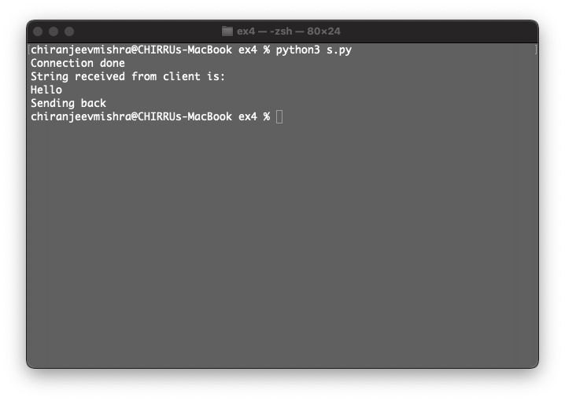

Client :
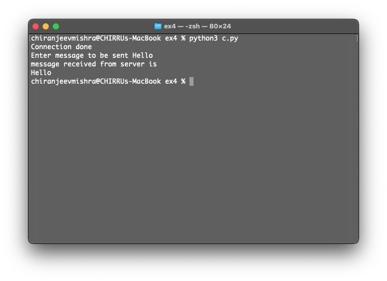

ex5( TRANSFERRING DATE AND TIME VALUES FROM SERVER TO CLIENT USING TCP)
Server :
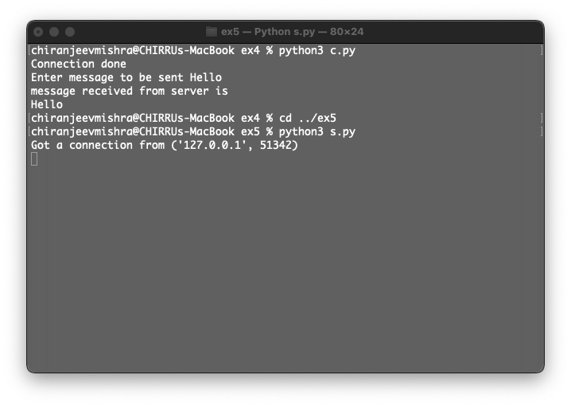

Client :
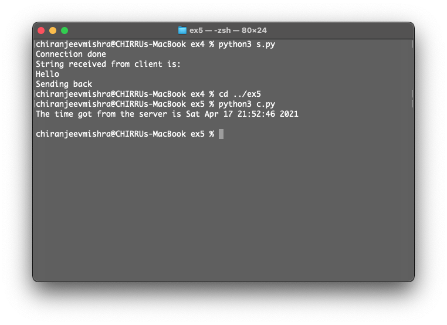

ex6( TO PERFORM A CALCULATOR SIMULATION USING TCP/IP (HALF DUPLEX))
Server :

Client :
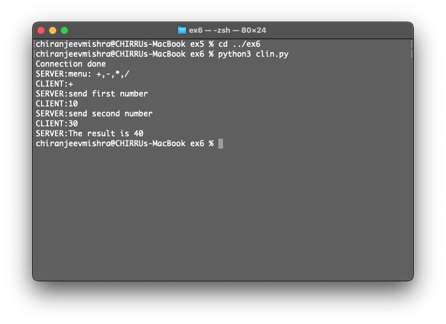

ex7( TO PERFORM -DUPLEX COMMUNICATION BETWEEN SERVER AND CLIENT)
Server :
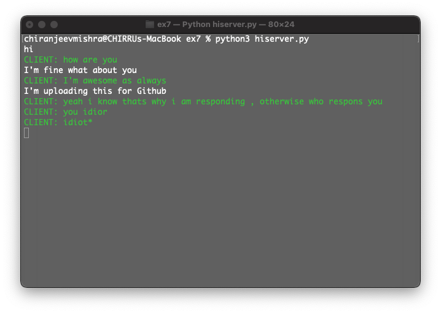

Client :
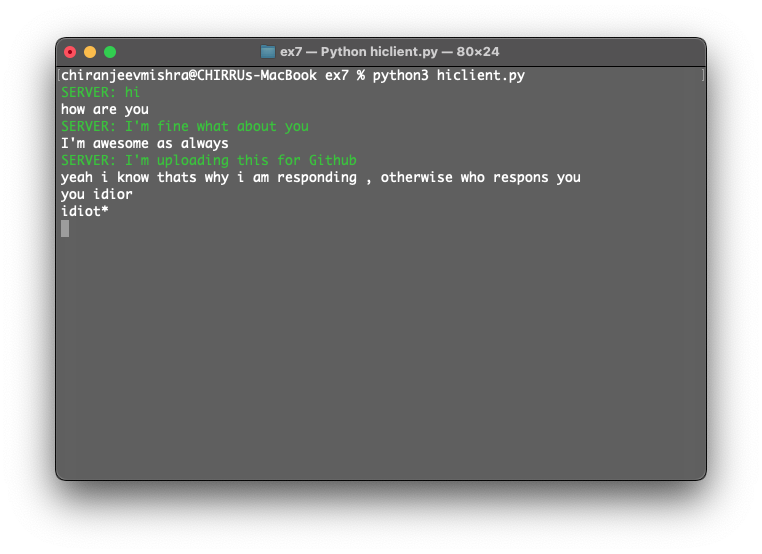

ex8(Implementation of File Transfer Protocol)
Server :
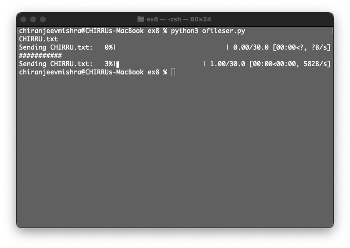

Client :

Additional File:
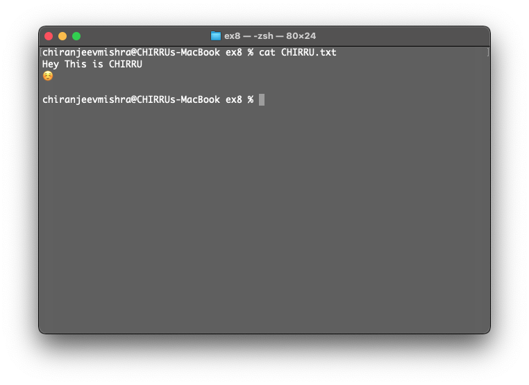

ex9(Remote Command Execution using UDP)

Server :
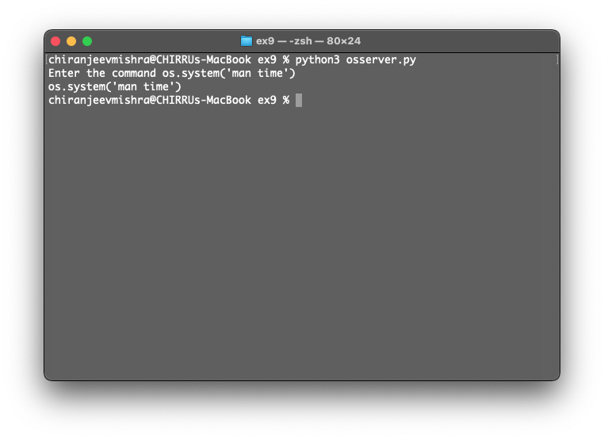

Client :
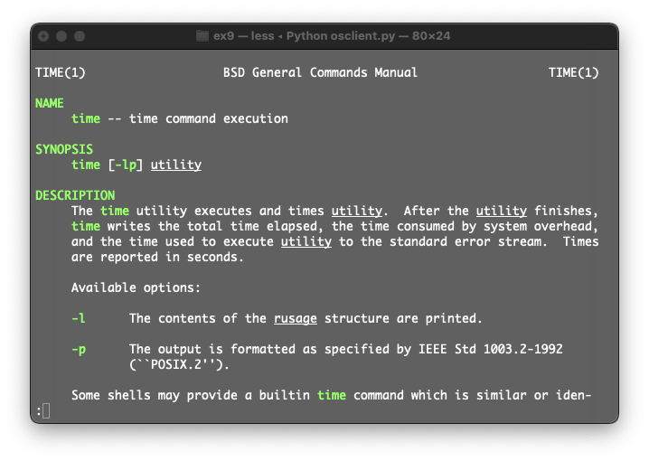
